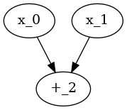

# CircuitSynthesis

This is a software implementation of the algorithm for finding an effective circuit over {1, +, &} from the article.

## Requirements and install

minisat
```
$ sudo apt install minisat
```

dot
```
sudo apt-get install graphviz
```

```
$ make
```

## Usage

```
$ ./cs n N x_{1} ... x_{2^n}
```
where n is number of input variables, N is circuit complexity, x_{1}, ..., x_{2^n} is vector of boolean function.

## Examples

```
$ ./cs 2 1 0 1 1 0
```


```
$ ./cs 3 6 1 0 1 0 1 1 0 0
```


